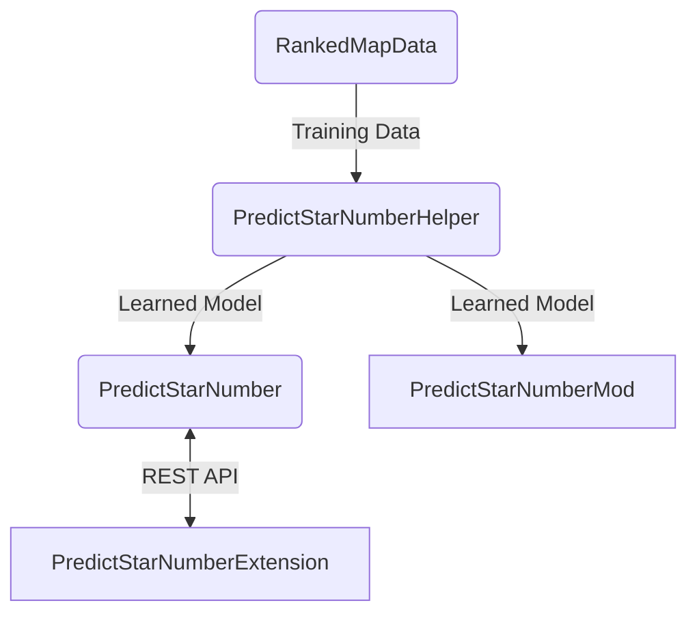

# PredictStarNumberExtension

## これはなに？
[PredictStarNumber](https://github.com/rakkyo150/PredictStarNumber)(BeatSaverで公開されている譜面のScoreSaberのランク基準の星の数を予測するアプリ)のChrome拡張機能版です。 
現在対応しているのは、BeatSaverに関しては譜面の個別ページで、ScoreSaberに関してはプレイ履歴、譜面検索ページと譜面の個別ページです。 

## 関連リンク

Training Data : https://github.com/rakkyo150/RankedMapData  
Model : https://github.com/rakkyo150/PredictStarNumberHelper  
Mod : https://github.com/rakkyo150/PredictStarNumberMod  
Chrome Extension : https://github.com/rakkyo150/PredictStarNumberExtension  

## 導入方法
Google Chromeの右上にあるパズルのピースみたいなアイコンから拡張機能を管理ページに移動してください。 
そのあと、右上にあるディベロッパーモードがオンになってない方はオンにして、「パッケージ化されていない拡張機能を読み込む」から、[Releases](https://github.com/rakkyo150/PredictStarNumberExtension/releases)にあるzipファイルを解凍したものを読み込んでください。 
その際、PredictStarNumberExtentionフォルダの直下に.jsファイルとmanifest.jsonファイルがあるというフォルダ構造になっていることを確認してください。
